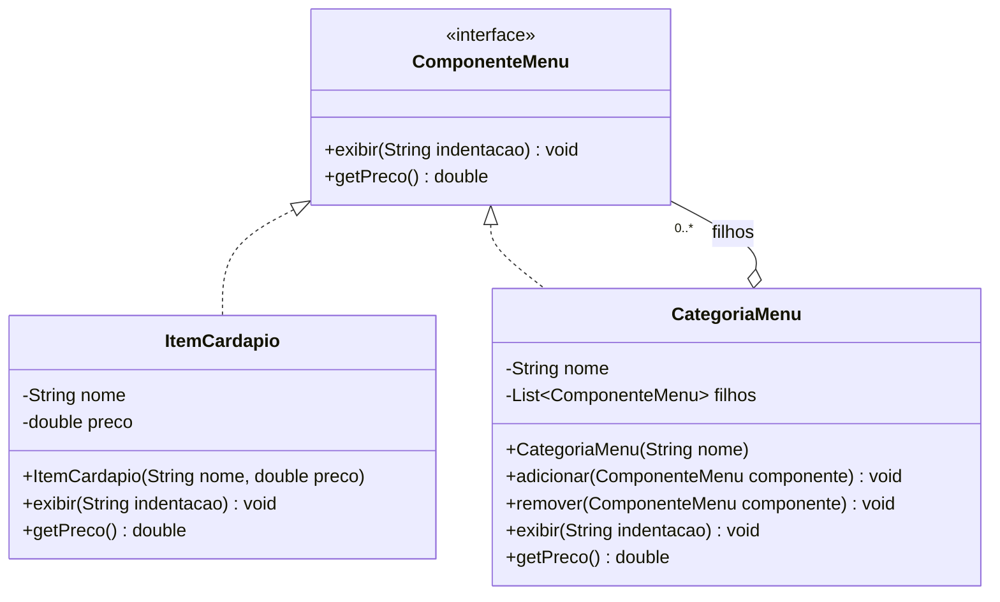

# Composite Pattern - UML

## Diagrama de classes

## Compatibilidade com o padrão

| Elemento | Papel |
|----------|-------|
| `ComponenteMenu` | Component |
| `ItemCardapio` | Leaf |
| `CategoriaMenu` | Composite |
| `filhos` | Lista que permite compor itens e categorias |

## Por que é um pattern?

- `ItemCardapio` e `CategoriaMenu` compartilham a mesma interface.
- O cliente pode tratar folhas e grupos como `ComponenteMenu`.
- `CategoriaMenu` pode conter outros `ComponenteMenu`, permitindo hierarquias recursivas.
- `getPreco()` soma os valores dos filhos, propagando o calculo pela arvore.
- O diagrama é compatível com o código em `Composite/Pattern`.
