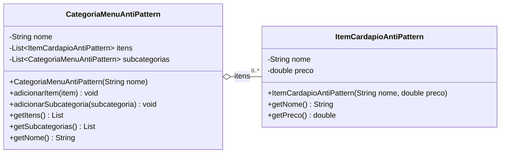

# Composite AntiPattern - UML

## Diagrama de classes

## Compatibilidade com o anti-pattern

| Elemento | Papel |
|----------|-------|
| `CategoriaMenuAntiPattern` | Classe que gerencia itens e subcategorias separadamente |
| `ItemCardapioAntiPattern` | Classe de item simples |
| `itens` | Lista exclusiva para folhas |
| `subcategorias` | Lista recursiva de outras categorias, representada como atributo para evitar um laco visual gigante no diagrama |

## Problemas

- Nao existe interface comum entre item e categoria.
- O cliente precisa chamar metodos diferentes para itens e subcategorias.
- O codigo precisa saber se esta lidando com `CategoriaMenuAntiPattern` ou `ItemCardapioAntiPattern`.
- A hierarquia existe, mas nao existe transparencia de tratamento como no Composite.

## Como corrigir?

Criar a interface `ComponenteMenu` e fazer tanto o item quanto a categoria implementarem `exibir()` e `getPreco()`.
