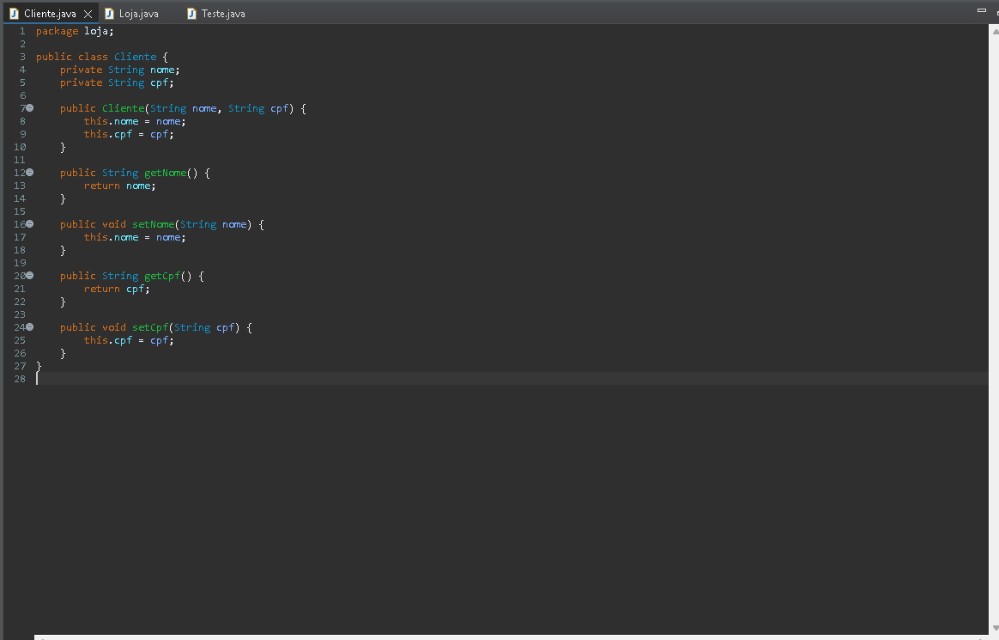
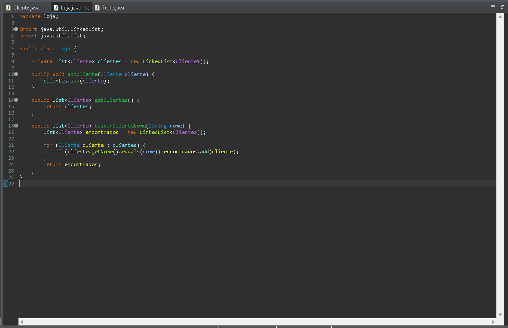
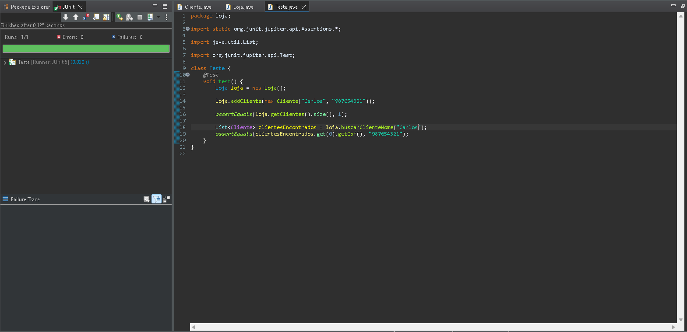
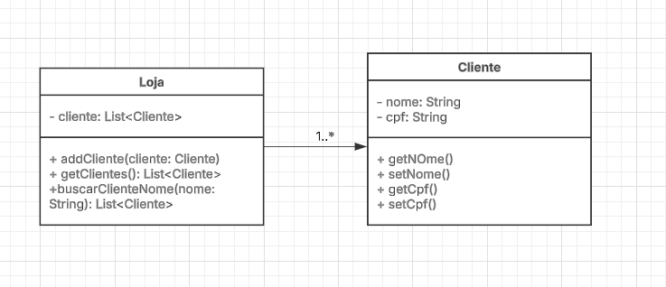
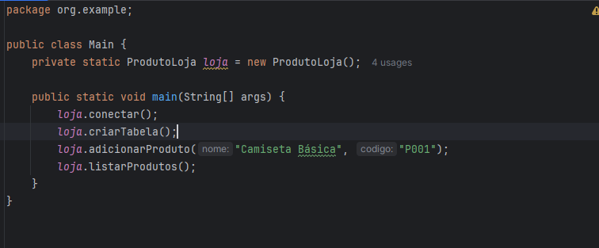
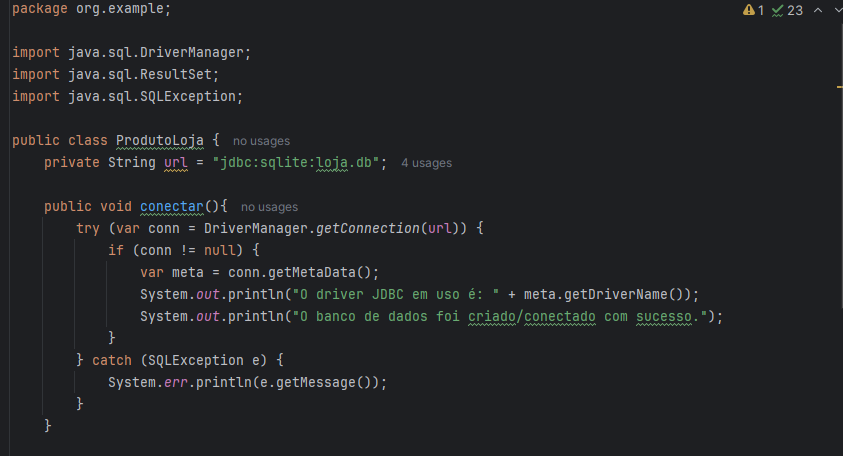
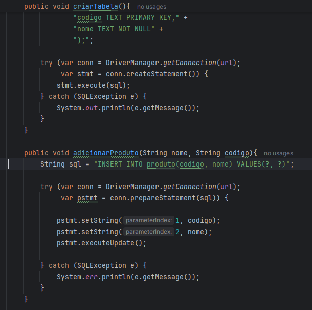
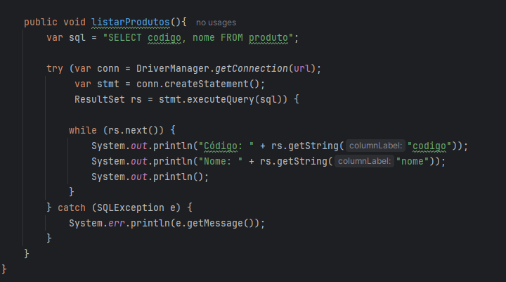
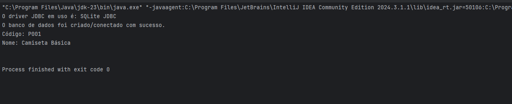

Atividade 1

a engenharia de software é uma engenharia igua todas as outras, porém na área de da programação, ele não fala sobre codar em si mas sim sobre como codar e como ajustar seu código para que ele funcione por um bom tempo, com uma qualidade como se fosse a estrutura do código seguindo o sentido de engenharia.

princípios fundamentais para manter o código sustentável: Tempo e Mudança (adaptação contínua do código), Escala e Crescimento (evolução da organização) e Compensações e Custos (tomada de decisões baseada nesses fatores).

Exemplos tradeoff

1. Velocidade de Desenvolvimento vs. Qualidade do Código
Pró: Desenvolver rapidamente permite lançar funcionalidades mais cedo e iterar com feedback real.
Contra: Código apressado pode acumular dívida técnica, tornando futuras manutenções mais difíceis e demoradas.
Exemplo: Optar por código rápido e sujo para um MVP pode ser útil no início, mas pode exigir refatoração depois.

2. Desempenho vs. Facilidade de Manutenção
Pró: Código altamente otimizado pode ser mais rápido e eficiente.
Contra: Otimizações excessivas podem dificultar a leitura e a manutenção do código.
Exemplo: Usar algoritmos complexos para melhorar a performance pode tornar o código menos compreensível para novos desenvolvedores.

3. Escalabilidade vs. Custos
Pró: Arquiteturas escaláveis garantem que o sistema suporte um grande número de usuários.
Contra: Soluções escaláveis (como microservices ou cloud auto-scaling) podem ser caras e desnecessárias no início.
Exemplo: Uma startup pode começar com uma aplicação monolítica simples antes de investir em uma infraestrutura distribuída.

Atividade 2

Codigos:

UML:

Ultima ATVD

