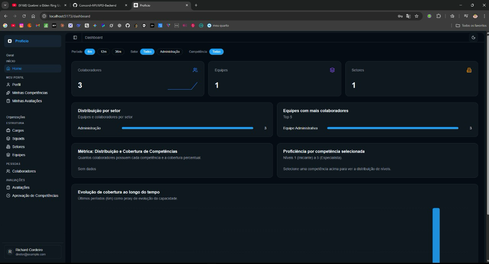

<h2>Sobre mim</h2>

Meu nome é Richard Leonardo Cordeiro, sou estudante de Banco de Dados na FATEC e atualmente estou no quarto semestre do curso.

Meu primeiro contato com programação aconteceu em 2020, quando comecei a acompanhar conteúdos sobre robótica. Esse interesse abriu caminho para a área de tecnologia e, em dezembro de 2022, iniciei meus estudos de forma mais prática com desenvolvimento web.

Desde então, venho desenvolvendo minhas habilidades em desenvolvimento full stack, com foco em criar soluções que integrem frontend, backend e banco de dados de forma organizada e eficiente.

Atualmente, faço estágio na DNX Soluções, atuando com desenvolvimento full stack utilizando C#. Além disso, estudo e pratico tecnologias como Java e JavaScript, buscando evoluir tanto na construção de interfaces quanto na implementação de regras de negócio e integração com dados.

## Contatos
* [GitHub](https://github.com/RichardCordeiro)
* [LinkedIn](https://www.linkedin.com/in/richardcordeiro/)

## Meus Principais Conhecimentos

**Aplicações e dados**

## Meus Projetos

### Em 2025-2 | Proficio

### Empresa Parceira: ALTAVE

### Problema:
A ALTAVE precisava de uma forma mais eficiente de mapear as competências de seus colaboradores. A empresa tinha dificuldade para alocar profissionais em equipes, squads ou demandas específicas porque não possuía uma visão centralizada das skills técnicas, soft skills, certificações, experiências e níveis de proficiência de cada pessoa.

Sem uma plataforma estruturada para consultar essas informações, a identificação de talentos e a organização de equipes dependiam de processos manuais, o que dificultava a tomada de decisão por parte de diretores e gestores.

### Solução Entregue pela Equipe:
A equipe desenvolveu o Proficio, uma plataforma de mapeamento de competências pensada como um "LinkedIn interno" para a empresa. A solução permite que colaboradores mantenham um perfil profissional com suas habilidades, certificações e informações relevantes, enquanto gestores e diretores conseguem visualizar dados consolidados para apoiar decisões estratégicas.

O sistema conta com controle de acesso por perfil, permitindo que colaboradores acessem suas próprias informações, gestores acompanhem dados de suas equipes e diretores visualizem dashboards, relatórios e métricas gerais. Também foram desenvolvidas funcionalidades para cadastro de usuários, gestores, colaboradores, equipes, setores, skills, avaliações, autoavaliações e filtros por competência.

Com isso, a plataforma facilita a identificação de profissionais com habilidades específicas, apoia a montagem de equipes, melhora a gestão de talentos e oferece uma visão mais clara da distribuição de competências dentro da empresa.

#### Principais Funcionalidades

- Dashboard por equipe com visualização de integrantes e distribuição de habilidades.
- Perfil individual para colaboradores com cadastro, edição e exclusão de skills.
- Controle de acesso por perfil para diretor, gestor e colaborador.
- Cadastro e listagem de gestores, colaboradores, equipes e setores.
- Dashboard com métricas de colaboradores, skills, setores e equipes.
- Avaliação de colaboradores e autoavaliação de proficiência.
- Cadastro de skills ainda não registradas no sistema.
- Filtros para busca de colaboradores por competência.

#### Tecnologias Utilizadas

  

> - **Java**: Utilizado no desenvolvimento do backend da aplicação.
> - **Spring Boot**: Utilizado para estruturação da API e criação das rotas do sistema.
> - **TypeScript e JavaScript**: Utilizados no desenvolvimento da interface e integrações do frontend.
> - **HTML, CSS e Tailwind CSS**: Utilizados na construção e estilização das telas.
> - **MySQL**: Utilizado para armazenamento e organização dos dados da plataforma.
> - **Docker**: Utilizado para facilitar a configuração e padronização do ambiente.
> - **Git e GitHub**: Utilizados para versionamento, colaboração e revisão de código.
> - **IntelliJ IDEA e VS Code**: Utilizados como ambientes de desenvolvimento.

#### Contribuições Pessoais

  
Desenvolvimento e estruturação do backend

   
  Atuei no desenvolvimento de grande parte do backend do projeto, estruturando funcionalidades, adicionando padrões ao código e criando rotas para atender às necessidades da plataforma. Essa atuação envolveu organizar a lógica da aplicação, contribuir para a consistência das entregas e garantir que as funcionalidades estivessem alinhadas aos requisitos definidos nas sprints.

  
Revisão de código e padronização do projeto

   
  Também participei da revisão de código, conferindo implementações, identificando pontos de melhoria e ajudando a manter um padrão mais consistente no projeto. Essa contribuição foi importante para reduzir problemas de integração, melhorar a organização do código e apoiar a equipe durante o desenvolvimento.

  
Ajustes no frontend

   
  No frontend, realizei ajustes básicos de funcionamento para apoiar a integração com o backend e melhorar o comportamento de algumas telas. Minha atuação principal ficou concentrada no backend, mas também contribuí em correções e adaptações pontuais na interface.

#### Hard Skills

- **Java**: Conhecimento intermediário
- **C#**: Conhecimento intermediário
- **HTML**: Conhecimento intermediário
- **CSS**: Conhecimento intermediário
- **JavaScript**: Conhecimento intermediário
- **SQL Server**: Conhecimento intermediário
- **MySQL**: Conhecimento intermediário
- **Git/GitHub**: Conhecimento intermediário
- **Docker**: Conhecimento básico
- **React**: Conhecimento básico
- **TypeScript**: Conhecimento básico

#### Soft Skills

**Comunicação**: Durante o desenvolvimento do projeto, utilizei uma comunicação clara com a equipe para alinhar decisões técnicas, revisar entregas e ajudar na resolução de conflitos do grupo. Essa postura contribuiu para manter o time mais organizado e focado nas entregas das sprints.

**Colaboração**: Atuei ajudando colegas em dificuldades, principalmente na revisão de código e na organização do backend. Essa colaboração facilitou a integração entre as partes do sistema e ajudou a manter um padrão mais consistente no projeto.

**Autodidatismo**: Ao longo do projeto, tive facilidade para aprender novas abordagens e aplicar esse conhecimento nas demandas da equipe. Busquei entender melhor as tecnologias e padrões utilizados para contribuir tanto no desenvolvimento quanto no apoio aos colegas.
◊